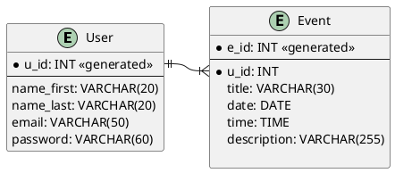

# cs3203_project
Task Manager for Software Engineering Project

## Creating the Database:

The following queries can be used to construct a MySQL database with the following format.

### User Table
```sql
CREATE TABLE `engineering_project`.`Users` (
    `u_id` INT(255) NOT NULL AUTO_INCREMENT,
    `name_first` VARCHAR(20) NOT NULL,
    `name_last` VARCHAR(20) NOT NULL,
    `email` VARCHAR(50) NOT NULL,
    `pass` VARCHAR(60) NOT NULL,
    PRIMARY KEY (`u_id`)
    ) 
    ENGINE = InnoDB COMMENT = 'User Data';
```
### Event Table
```sql
CREATE TABLE `engineering_project`.`Events` (
    `e_id` INT(255) NOT NULL AUTO_INCREMENT,
    `u_id` INT(255) NOT NULL,
    `title` VARCHAR(30) NOT NULL,
    `e_date` DATE NOT NULL,
    `e_time` TIME NOT NULL,
    `description` VARCHAR(255) NOT NULL,
    PRIMARY KEY (`e_id`)
    )
    ENGINE = InnoDB COMMENT = 'A User Created event';
```
### Foreign-Key Relationship
```sql
ALTER TABLE `Events` ADD CONSTRAINT `User_Event` FOREIGN KEY (`u_id`) REFERENCES `Users`(`u_id`) ON DELETE RESTRICT ON UPDATE RESTRICT;
```

### Query all of a User's Events
```sql
SELECT * FROM Events
WHERE u_id = '<user_id>' 
```
replacing '<user_id>' with the desired ID.  
To only select certain attributes/columns: replace '*' with '(u_id, title, date)' for example
### Add an event
```sql
INSERT INTO Events (u_id, title, e_date, e_time, discription) 
VALUES (<'u_id>', '<title>', '<e_date>', '<e_time>', '<discription>')
```
Replacing the brackets with the actual values 
### Add User
```sql
INSERT INTO Users (name_first, name_last, email, pass)
VALUES ('<name_first>','<name_last>','<email>','<pass>')
```
Replacing the brackets with the actual values